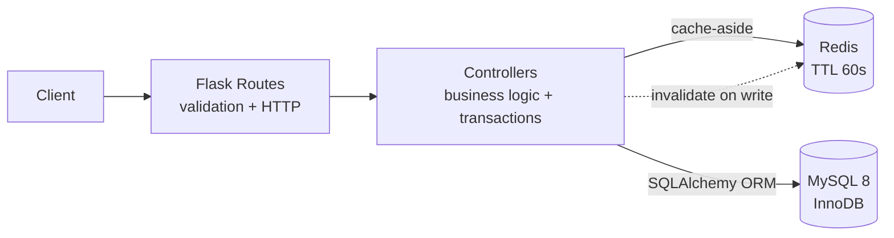
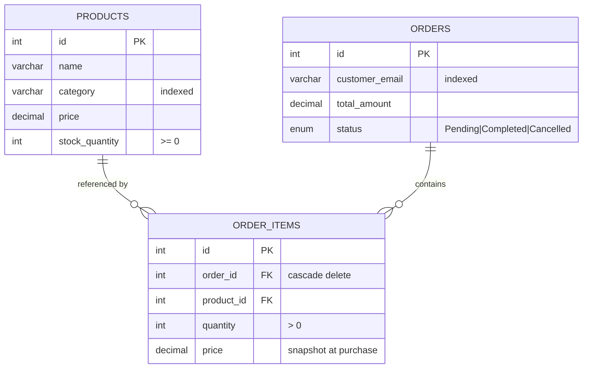

# 🛍️ E-Commerce RESTful API & Inventory Management Service

High-throughput Python **Flask** backend for product catalog management and order processing, backed by **MySQL** for durable transactional storage and **Redis** for sub-millisecond catalog reads.


---

## ⚡ Architecture Highlights

- **🚀 Redis cache-aside layer** — catalog reads drop from **10.49 ms → 1.90 ms (5.5× faster, 81.9 % lower latency)**, measured over 50 runs against a 200-product catalog.
- **🔒 Oversell-proof inventory** — stock is decremented inside a single transaction using `SELECT … FOR UPDATE` row locks. Verified by a concurrency test where **10 simultaneous buyers race for 5 units and exactly 5 succeed**.
- **🧯 Deadlock-resistant** — rows are always locked in ascending `product_id` order, so concurrent multi-item orders can never form a lock cycle.
- **🛡️ Fails open, not down** — if Redis becomes unreachable the API transparently falls back to MySQL instead of returning 5xx.
- **🧱 Layered architecture** — `routes → controllers → models`, with cross-cutting cache, validation and error-handling modules.
- **🐳 Fully containerised** — `docker compose up` provisions MySQL, Redis and the API with health checks.

---

## 🧭 System Design



**Read path:** check Redis → on miss query MySQL → populate Redis → return with `meta.cached`.
**Write path:** commit to MySQL → invalidate `products:*` → next read repopulates.

---

## 🗂️ Project Structure

```text
swe-ecommerce-inventory-service/
├── app/
│   ├── __init__.py              # application factory, timing middleware
│   ├── config.py                # env-driven Dev/Test/Prod configs
│   ├── extensions.py            # SQLAlchemy singleton
│   ├── controllers/             # business logic + transactions
│   │   ├── product_controller.py
│   │   └── order_controller.py
│   ├── models/                  # Product, Order, OrderItem
│   ├── routes/                  # HTTP blueprints
│   ├── schemas/validators.py    # request validation
│   ├── services/redis_service.py# fail-open cache layer
│   └── utils/                   # error types + response envelope
├── db/init.sql                  # schema, auto-run by the MySQL container
├── scripts/
│   ├── seed_data.py             # demo catalog generator
│   └── benchmark.py             # cached vs uncached latency
├── tests/                       # 48 tests incl. concurrency proofs
├── requests/api.http            # REST Client collection
├── docker-compose.yml
├── Dockerfile
└── requirements.txt
```

---

## 🚀 Quick Start

### Prerequisites
Python 3.12+ · Docker Desktop · Git

### 1. Clone
```bash
git clone https://github.com/mvigneswar/swe-ecommerce-inventory-service.git
cd swe-ecommerce-inventory-service
```

### 2. Configure environment
```bash
cp .env.example .env      # Windows: copy .env.example .env
```
The API container reads `MYSQL_HOST=mysql` / `REDIS_HOST=redis` automatically
from `docker-compose.yml` — you only need `.env` for the **local dev** path below.

---

### Option A — Full stack in Docker (recommended, one command)
```bash
docker compose up -d --build
```
This boots **MySQL + Redis + the API** together. The schema in `db/init.sql`
is applied on first boot, and the API waits for the database to be ready before
accepting traffic. The API is then live on **http://localhost:5000**.

```bash
docker compose ps            # confirm all three are "healthy"
curl http://localhost:5000/api/health
docker compose logs -f api   # tail API logs
docker compose down          # stop the stack
```

### Option B — Local Flask against Docker MySQL + Redis
```bash
# 1. start only the data services
docker compose up -d mysql redis

# 2. create a virtualenv and install deps
python -m venv venv
.\venv\Scripts\activate        # macOS/Linux: source venv/bin/activate
pip install -r requirements.txt

# 3. seed demo data and run
python scripts/seed_data.py --count 200
python app.py                 # http://localhost:5000
```

**Make targets** wrap the common actions (`make help` lists them):
`make setup · make compose-up · make seed · make test · make benchmark`.

API is live at **http://localhost:5000** — verify with `GET /api/health`.

---

## 📡 API Reference

Base URL `http://localhost:5000`

| Method | Endpoint | Description | Caching |
| :--- | :--- | :--- | :--- |
| `GET` | `/api/health` | Liveness + MySQL/Redis status + cache hit rate | — |
| `GET` | `/api/products` | List products — `?category=` `?search=` `?page=` `?limit=` | Redis, 60 s TTL |
| `GET` | `/api/products/categories` | Distinct category list | — |
| `GET` | `/api/products/<id>` | Single product | Redis, 60 s TTL |
| `POST` | `/api/products` | Create product | Invalidates `products:*` |
| `PUT` | `/api/products/<id>` | Partial update | Invalidates `products:*` |
| `DELETE` | `/api/products/<id>` | Delete product | Invalidates `products:*` |
| `POST` | `/api/orders` | Place order, atomically decrement stock | DB transaction |
| `GET` | `/api/orders` | List orders — `?email=` `?page=` `?limit=` | — |
| `GET` | `/api/orders/<id>` | Order detail with line items | — |
| `POST` | `/api/orders/<id>/cancel` | Cancel order and restore stock | Invalidates `products:*` |

### Response envelope

Every endpoint returns the same shape.

```jsonc
// success
{
  "success": true,
  "data": [ /* ... */ ],
  "meta": { "cached": true, "response_time_ms": 1.68,
            "pagination": { "page": 1, "limit": 20, "total": 200, "pages": 10 } }
}

// failure
{
  "success": false,
  "error": {
    "code": "INSUFFICIENT_STOCK",
    "message": "Insufficient stock for 'Mechanical Keyboard'.",
    "details": { "product_id": 1, "requested": 999, "available": 7 }
  }
}
```

### Error codes

| Code | HTTP | Meaning |
| :--- | :---: | :--- |
| `VALIDATION_ERROR` | 400 | Malformed or missing fields |
| `NOT_FOUND` | 404 | Product or order does not exist |
| `INSUFFICIENT_STOCK` | 409 | Requested quantity exceeds stock |
| `CONFLICT` | 409 | Lock contention, or order already cancelled |
| `INTERNAL_SERVER_ERROR` | 500 | Unexpected failure (details never leaked) |

### Example — place an order

```bash
curl -X POST http://localhost:5000/api/orders \
  -H "Content-Type: application/json" \
  -d '{"customer_email":"buyer@example.com",
       "items":[{"product_id":2,"quantity":3}]}'
```

---

## 🗄️ Data Model



All tables use **InnoDB** (required for row-level locking and foreign keys) with `utf8mb4`. `order_items.price` stores a price snapshot so historical orders stay accurate when the catalog price changes.

---

## 🔒 Concurrency Deep-Dive

The core risk in any inventory system is two customers buying the same last unit. This service prevents it at the database level:

```python
product = (
    db.session.query(Product)
    .filter(Product.id == product_id)
    .with_for_update()      # exclusive row lock until commit/rollback
    .first()
)
if product.stock_quantity < quantity:
    raise InsufficientStockError(...)   # rolls back the whole transaction
product.stock_quantity -= quantity
```

Three properties make this safe:

1. **Row locking** — a second transaction blocks on `with_for_update()` until the first commits, so it always reads post-decrement stock.
2. **Deterministic lock order** — items are sorted by `product_id` before locking, eliminating the classic ABBA deadlock.
3. **All-or-nothing** — if line 5 of an order is out of stock, lines 1-4 are rolled back; stock never drifts.

Proven by `tests/test_orders.py::TestConcurrency`, which spawns real threads synchronised on a barrier to maximise the race window.

---

## 🧪 Testing

```bash
pytest                       # 48 tests
pytest --cov=app             # with coverage
pytest -m concurrency        # race-condition proofs only
```

Tests run against an isolated `ecommerce_test_db` that is dropped and recreated per test.

| Suite | Covers |
| :--- | :--- |
| `test_products.py` | CRUD, filtering, search, pagination, validation, 404s |
| `test_orders.py` | Order totals, stock decrement, oversell rejection, rollback, cancellation, **concurrency** |
| `test_cache.py` | Key determinism, graceful degradation when Redis is down |

```
============================= 48 passed in 19.63s =============================
```

---

## 📊 Benchmark

```bash
python scripts/benchmark.py --runs 50
```

| Scenario | mean | median | p95 | min |
| :--- | ---: | ---: | ---: | ---: |
| MySQL (cold) | 10.49 ms | 9.68 ms | 11.16 ms | 8.22 ms |
| Redis (cached) | **1.90 ms** | 1.68 ms | 2.82 ms | 1.44 ms |

**5.5× speed-up · 81.9 % latency reduction** — 200-product catalog, 20 rows per page.

---

## ⚙️ Configuration

| Variable | Default | Purpose |
| :--- | :--- | :--- |
| `PORT` | `5000` | API port |
| `MYSQL_HOST` / `MYSQL_PORT` | `localhost` / `3307` | Host port avoids clashing with a local MySQL on 3306 |
| `MYSQL_USER` / `MYSQL_PASSWORD` | `ecom_user` / — | Application DB credentials |
| `MYSQL_DATABASE` | `ecommerce_db` | Schema name |
| `REDIS_HOST` / `REDIS_PORT` | `localhost` / `6379` | Cache endpoint |
| `CACHE_TTL_SECONDS` | `60` | Catalog cache lifetime |
| `DEFAULT_PAGE_SIZE` / `MAX_PAGE_SIZE` | `20` / `100` | Pagination guards |
| `LOG_LEVEL` | `INFO` | Logging verbosity |

---

## 🐳 Docker

`docker-compose.yml` defines three services on a shared bridge network:

| Service | Image | Host port | Role |
| :--- | :--- | :---: | :--- |
| `mysql` | `mysql:8.0` | `3307 → 3306` | InnoDB storage, schema from `db/init.sql` |
| `redis` | `redis:7-alpine` | `6379` | Cache (AOF + LRU, 256 MB cap) |
| `api` | built from `Dockerfile` | `5000` | Gunicorn, `FLASK_ENV=production` |

```bash
docker compose up -d --build   # build + start the whole stack
docker compose ps              # all three should report "healthy"
docker compose logs -f api     # tail API logs
docker compose down            # stop, keep data
docker compose down -v         # stop and wipe volumes
```

Key production hardening baked into the image:
- **Non-root user** — the app runs as `appuser`, not root.
- **`FLASK_ENV=production`** — `DEBUG` is off inside the container.
- **Gunicorn** — 4 workers, `app:create_app()` calls the factory (the package does not expose a module-level `app`).
- **`HEALTHCHECK`** — probes `/api/health`; `api` only starts after `mysql` and `redis` are `service_healthy`.
- **DB-start resilience** — the factory retries the connection and runs `create_all()` on boot, so a slow `init.sql` never 500s the first requests.

---

## 🛠️ Tech Stack

**Runtime** Python 3.12 · Flask 3.1 · Gunicorn
**Data** MySQL 8 (InnoDB) · SQLAlchemy 2.0 · PyMySQL · Redis 7
**Quality** pytest · pytest-cov
**Ops** Docker · Docker Compose

---
